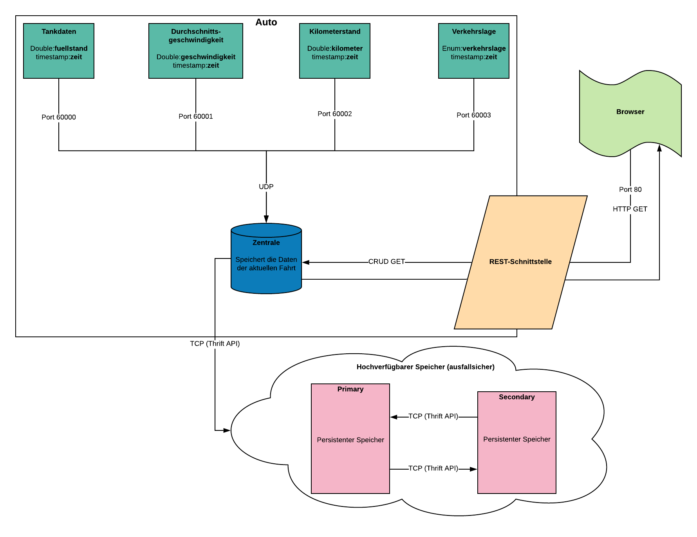

# Verteilte Systeme WS 2020/2021 - Praktikum - A. Füssel - K. Kriegbaum
## Implementierung eines Autos als verteiltes System
Nach erfolgreichem build und run via Docker und docker-compose laufen 4 Sensoren, 
die permanent Daten an eine Zentrale senden.
Die Zentrale verarbeitet die Daten und gibt Sie auf der Standardausgabe aus.

## REST & HTTP Routen
Die zentrale stellt eine REST-Schnittstelle zur Verfügung, die GET requests verarbeiten kann.  
Die Daten der laufenden Anwendung sind unter folgenden URL's zu erreichen:  

Zentrale:  
http://localhost:8080/


Aktueller Wert aller Sensoren:  
http://localhost:8080/sensors/


Alle Werte des Sensors Durchschnittsgeschwindigkeit:  
http://localhost:8080/sensors/Durchschnittsgeschwindigkeit/


Alle Werte des Sensors Verkehrslage:  
http://localhost:8080/sensors/Verkehrslage/


Alle Werte des Sensors Kilometerstand:  
http://localhost:8080/sensors/Kilometerstand/


Alle Werte des Sensors Tank:  
http://localhost:8080/sensors/Tank/


## Verwendete Programmiersprache:
JAVA

## Link zu den Anforderungen
[Issues Board](https://code.fbi.h-da.de/distributed-systems/2020_wise_lab/group_b_10/-/boards)

## Testing
Unsere geplanten Tests und deren Beschreibung sind mit entsprechenden Lables auf dem [Issues Board](https://code.fbi.h-da.de/distributed-systems/2020_wise_lab/group_b_10/-/boards) dokumentiert

## Definition of DONE
Wir verstehen ein Issue als DONE, wenn der Tutor oder der Professor das Issue als erledigt bestätigt und die Aufgabe somit im Sinne der Praktikumsaufgabe als bestanden gilt. Das Issue wird dann von der column "Ready" in "Closed" verschoben.

## Setup:
Stellen Sie sicher, dass Sie Docker und Docker-Compose installiert haben, um die unteren Befehle ausführen zu können.

- [Docker](https://docs.docker.com/) - Empfohlene Version 19.03
- [Docker-Compose](https://docs.docker.com/compose/install/) - Empfohlene Version 1.24

```
# Navigiere zum Projektverzeichnis
$ cd projekt-root-dir

# Projekt images erzeugen
$ docker-compose -f docker-compose.yml build

# Projekt ausführen
$ docker-compose -f docker-compose.yml up
```

Wenn Fehler auftreten, probieren Sie folgendes (Auf eigene Gefahr)
```
$ docker system prune -a -f
```


## Systemdesign


